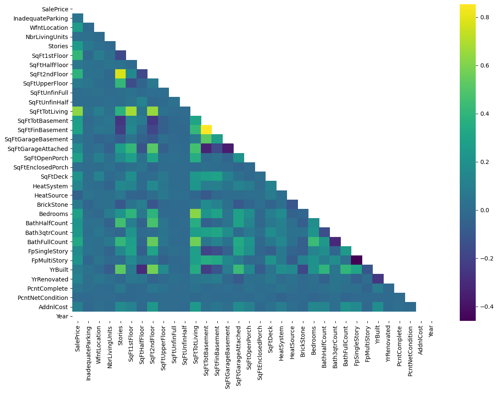
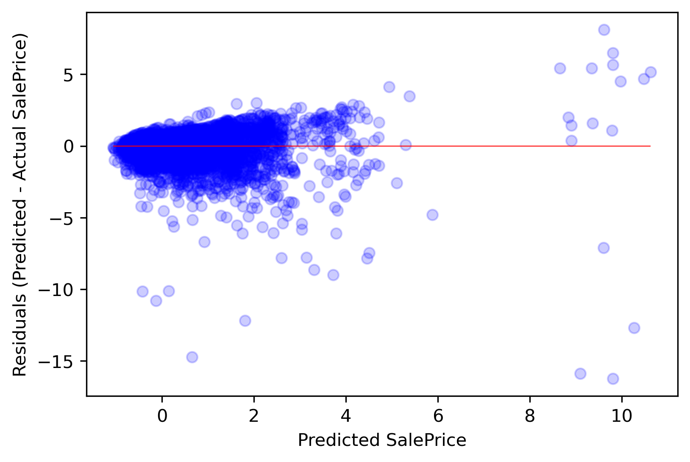
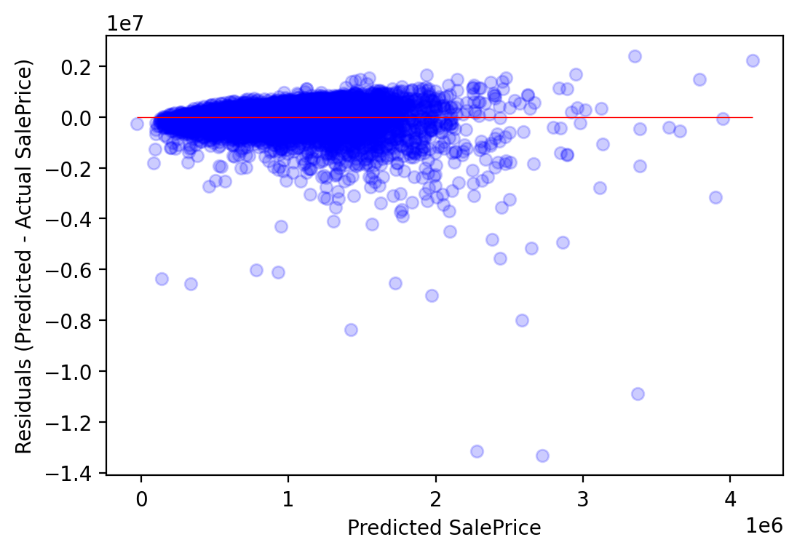
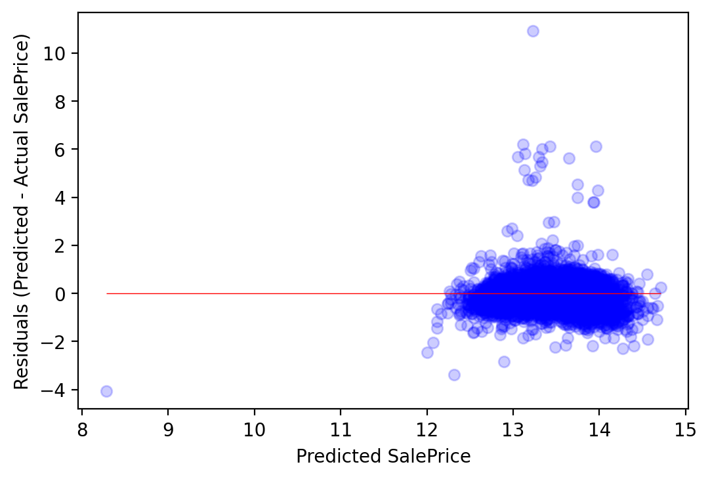

# King County Home Price Analysis

This repository offers an analysis of factors that influence housing prices in King County, WA


Environment setup process:

- conda create --name ENV

- conda activate ENV


## Business Understanding

King County is located in the U.S. state of Washington. The population was 2,252,782 in the 2019 census estimate, making it the most populous county in Washington, and the 12th-most populous in the United States. All this growth has increased demand for housing and caused home prices to skyrocket. A client in King County, WA wants to advise homeowners on home improvement projects that will add sale value of their homes.


This is a complex market for home buyers and my goal is to build a linear regression model to represent home sale prices in King County, and use it to advise homeowners on which home improvement projects will add to their home sale values.

## Data Understanding

The tables required for this analysis are:

- Real Property Sales 
- Residential Building 
- Parcel 

There were total of 251300 rows and 136 columns in the 

## Data Preparation

Imported all the packages and loaded the csv file into dataframe. I have done initial cleaning of the data before merging them. Using (Major and Minor)columns, i merged all the three tables. There were about (251300 rows and 136 columns) in my initial data process. After thorough cleaning of the data, i narrowed down to (18204 rows and 57 columns). I used these 57 columns for my linear regression process. I followed CRISP-DM process.


## Modeling

I used OLS Regression Results and Scikit Learn to build a multilinear regression model to predict house prices using the King County House Sales dataset.











## Evaluation

Started with simple linear regression model. In model2 added log transform for both targeted variable and predictor but there was a drop in R-squared value. In model3 removied outliers from targeted variable and proceed with analysis. With an increase in 1 sqft, the saleprice is expected to increase by $200.44. In the model4 performed square root scaling and With an increase in 1 sqft, the saleprice is expected to increase by $1.825e+04. In the model5 added new predictors and the R-squared value has increased from 0.313 to 0.399. In the model6 added additional predictors such as SqFt1stFloor, SqFt2ndFloor, BathFullCount and the  R-squared value has increased from 0.399 to 0.40.

In the model7 added categorical features. Adding categorical features such as 'HeatSystem', 'HeatSource', 'Bedrooms', 'BldgGrade', Model 7 tells that about 53.2% variance of SalePrice. But the p-value(0.03777) is lesser than (alpha=0.05) alpha value. So we reject the null hypothesis. It fails to the linearity assumptions. 


## Conclusion

Home buyers in this market who are looking to maximize their dollars should carefully consider the locations in which they search. This will make the biggest impact on how far their budget will go. The second most important factor in housing is the square footage of the house.

This model can account for 53.2% of the variability in house prices in King County, which is a 10% increase from my initial model. I think the model is a decent start, but could be improved by doing more to work out the best transformation method for each feature.

## Next Step

- The model has some limitations to satisfy regression assumptions.

- Our model has multicollinear relationship between the variables. Hence futher processing needs to be done on removing the multicollinearity.

- Stepwise selection can be done to further narrowdone the feature of the model.

## This Repository

### Repository Directory

```
├── README.md        <-- Main README file explaining the project's business case,
│                        methodology, and findings
│
├── data             <-- Data in CSV format
│   ├── processed    <-- Processed (combined, cleaned) data used for modeling
│   └── raw          <-- Original (immutable) data dump
│
├── notebooks        <-- Jupyter Notebooks for exploration and presentation
│   ├── exploratory  <-- Unpolished exploratory data analysis (EDA) notebooks
│   └── report       <-- Polished final notebook(s)
│
├── references       <-- Data dictionaries, manuals, and project instructions
│
└── reports          <-- Generated analysis (including presentation.pdf)
    └── figures      <-- Generated graphics and figures to be used in reporting
```
